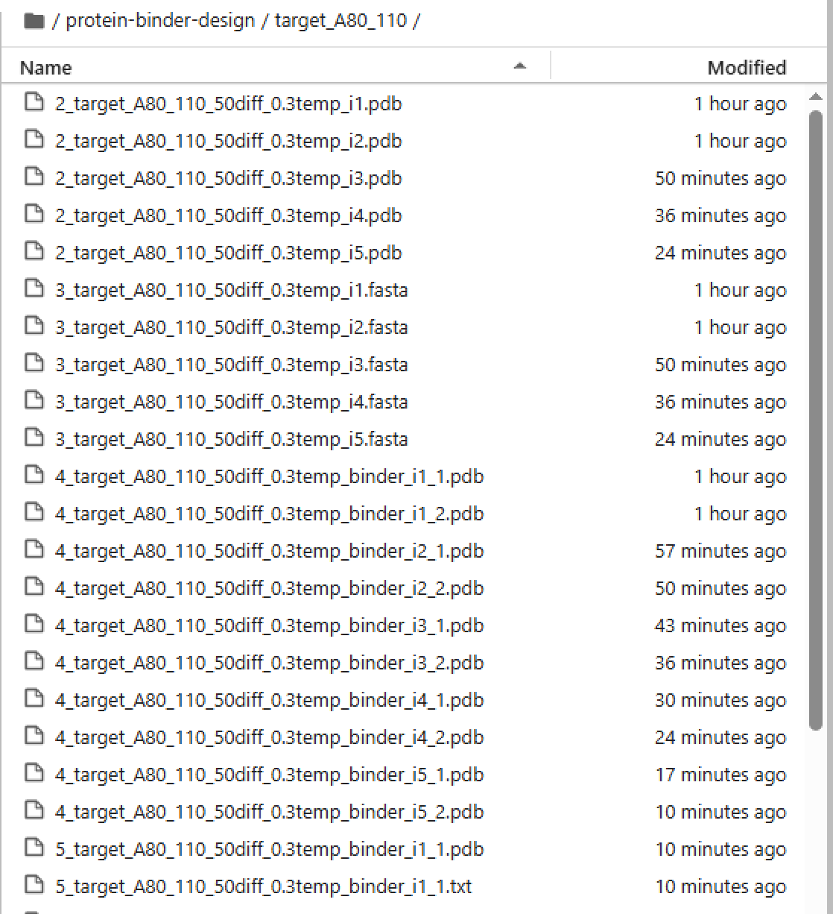
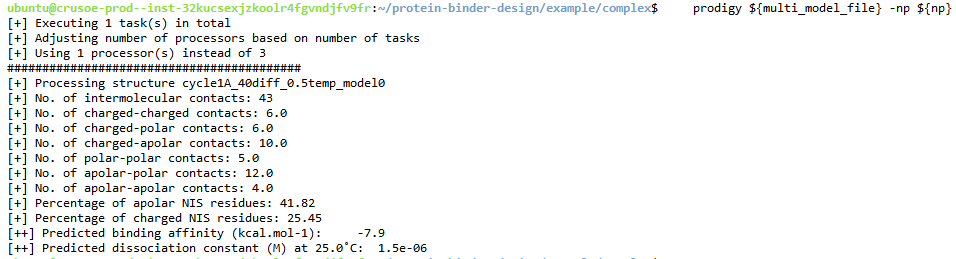
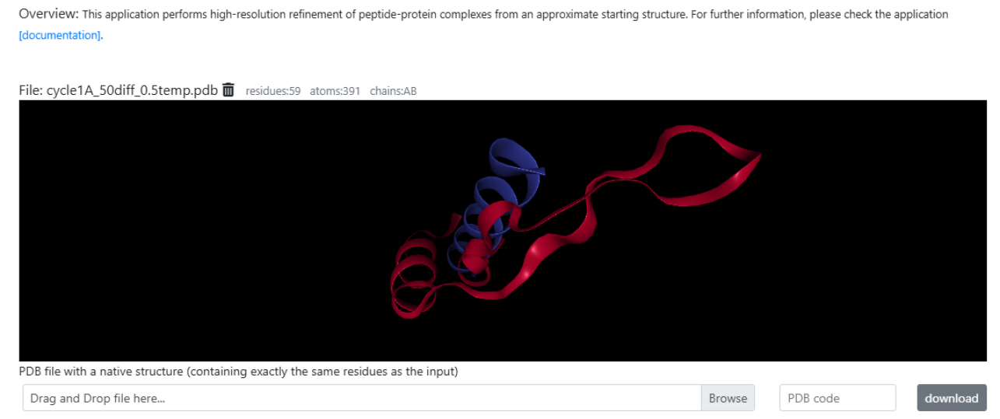
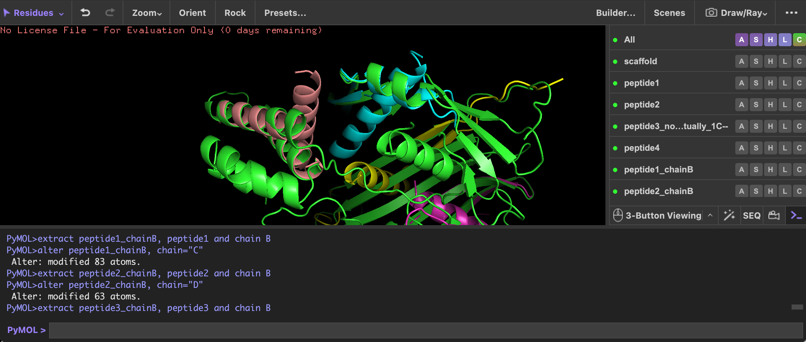

# Adaption of NVIDIA BioNeMo: Protein Binder Design

This workflow is designed for _in silico_ protein binder design by generating binder sequences and predicted structures for the binder and target. Unlike the original NVIDIA pipeline, this approach **does not** require running Alphafold2 on cloud GPU. 

Instead, you will first pre-compute the target protein structure on [AlphaFold2 colab](https://colab.research.google.com/github/sokrypton/ColabFold/blob/main/AlphaFold2.ipynb#scrollTo=R_AH6JSXaeb2) (model #1), and save it as a `.PDB` file. This becomes the input for **RFDiffusion** (model #2), which generates the protein backbones for binder design. Subsequently, **ProteinMPNN** (model #3) will back-generate the amino acid sequence of this protein binder. Finally, this generated peptide structure is validated (step #4) on [PRODIGY](https://rascar.science.uu.nl/prodigy/) (Gibbs Free Energy) and Rosetta [FlexPepDoc](https://r2.graylab.jhu.edu/auth/login?next=%2Fapps%2Fsubmit%2Fflexpepdock). 

The example below generates 8 peptide binders for target protein ApoB-100.

### System Requirements

- at least **240 GB** of fast NVMe SSD space *(assuming you're not running AlphaFold2. If so, you will need at least 2TB)*
- at least **24 CPU** cores
- at least **64 GB RAM**
- 2 or more NVIDIA L40s, A100, or H100 GPUs

### Hardware requirements

- Total: 2 x GPU, 47 GiB GPU memory, 1.3TB GB SSD drive space, 60GiB RAM,24 CPU

    - **RFdiffusion** runs on 1 x GPU, ≥12 GiB GPU memory, 15GB free SSD drive space
    - **ProteinMPNN** runs on 1 x GPU, ≥3 GiB GPU memory, 10GB free SSD drive space

### Software Pre-requisites

- Python 3.11+

## 1. Manually select binding sites on target protein

 **Fig 1**. 3D model of ApoB-100 (target) on SWISS-MODEL

1. Get on the [SWISS-MODEL](https://swissmodel.expasy.org/) repository and search for your target protein to view the interactive 3D model. In this example, we used [ApoB-100](https://swissmodel.expasy.org/repository/uniprot/P04114?template=9eag.1.A&range=38-4563) (**Fig 1**).
2. Define your 'binding window' size, which affects how long your generated peptide binder will be. In this example, we designed 8 binding windows of **40aa** in length.
3. Manually select the sequences for these 8 binding sites, using the 3D interactive model to help orient you. In this example, we chose 4 peptides in the first target region of ApoB (residues A91–357; **cycle 1**) and 4 peptides in a second target region (residues A390–642; **cycle 2**). The full *ApoB-100* protein backbone consists of 4,563 amino acids (**Fig 2**).

 **Fig 2**. Manually identify the 8 target binding sites

**Table 1**. 2 target sequences of length 40 amino acids.

| Cycle         | ApoB-100 target sequence          | Amino Acid Position |
|---------------|---------------------------------------------|---------------------|
| 1A      | LKTSQCTLKEVYGFNPEGKALLKKTKNSEEFAAAMSRYEL    | A91-130            |
| 1B      | EEAKQVLFLDTVYGNCSTHFTVKTRKGNVATEISTERDLG    | A170-209           |

## 2. Launch a NVIDIA cloud virtual machine (VM)

1. Go to [brev.nvidia](https://brev.nvidia.com/) and click on this [Launchable](https://brev.nvidia.com/launchable/deploy/now?launchableID=env-32aLABBLqme9fNaaSdVL94Bollg). If you would like to create your own, click on Launchables in the menu bar, then `Create Launchables` and follow these settings:
    - Select "I have codes in a git repository" and enter the URL of this repo
    - Select 'VM-mode'
    - Click "Next" until you finally reach **select compute**. We recommended **A100 (80GiB) 2 GPUs x 24 CPUs | 240GiB  (80GiB GPU memory) ($3.96/hr)**


2. Click **"Deploy Launchable"** and **"Go to Instance Page"**. Wait ~10 minutes for VM to start

3. Enter the VM, then drag and drop the AlphaFold2 .pdb files from **step (2)** into the VM workspace, under `protein-binder-design/input/`

4. Start a new terminal session by clicking the "+" button at the top right.

5. An **NGC Personal API Key** is required to download and run any NVIDIA NIMs. If this is your first time, start by creating an account on [NGC](https://catalog.ngc.nvidia.com/). Then [generate the key](https://org.ngc.nvidia.com/setup/api-key) and note it down somewhere secure for future use.

```bash
    export NGC_CLI_API_KEY=<enter-key> 
    docker login nvcr.io --username='$oauthtoken' --password="${NGC_CLI_API_KEY}"
```

6. Build inference models via docker container. Wait 20-30mins for the docker to build.

```bash
    # Install Dependencies
    sudo apt-get update # updated nvidia toolkit
    sudo apt-get install -y docker-compose # docker compose version 2+
    sudo apt install python3.11

    # The NIM cache allows you to download models and store previously-downloaded models on your local/server disk,
    mkdir -p ~/.cache/nim
    chmod -R 777 ~/.cache/nim    
    export HOST_NIM_CACHE=~/.cache/nim

    # From the root of the cloned protein-binder-design repository:
    cd protein-binder-design/deploy/
    docker compose up # runs /deploy/docker-compose.yaml
```

7. Open a new terminal, leaving the current terminal open with the launched service.

8. In the new terminal, view running containers with the following codes. Wait until the health check returns `{"status":"ready"}` before proceeding.

```bash
    # 1. Check storage space
    df -h 

    # 2. Check which dockers are currently active/on stand-by
    docker container ls
    docker ps 

    # 3. Health check  # shoud be {"status":"ready"}
    curl localhost:8081/v1/health/ready # AlphaFold2
    curl localhost:8082/v1/health/ready # RFdiffusion
    curl localhost:8083/v1/health/ready # Protein MPNN

    # View log 
    docker logs -f protein-binder-design-alphafold-1
```

## 3. Download command-line tools

```bash
    pip install prodigy-prot # PRODIGY - binding affinity prediction
    pip install biopython
    pip install pdb-tools
    python3.11 -m pip install torch
```

## 4. Run clean up and installation

```bash
    # clean up scripts before running
    sed -i 's/\r$//' "${REPO_DIR}/scripts/get_target_pdb.sh" # optional (to remove any hidden spaces from Windows)
    sed -i 's/\r$//' "${REPO_DIR}/scripts/calc_prodigy.sh" 
    sed -i 's/\r$//' "${REPO_DIR}/input/target_hotspots.txt" 
    sed -i 's/^[ \t]*//;s/[ \t]*$//' "${REPO_DIR}/scripts/calc_prodigy.sh"
```

```bash
    # Export API key (assume it has already been generated)
    export NGC_CLI_API_KEY=<enter-key>
```

## 5. Run RFDiffusion, ProteinMPNN and AlphaFold2-Multimer

- **RFDiffusion**: takes in the target protein PDB structure, outputs a designed peptide binder PDB. Note: every output is a glycine, and no sidechains are output. Read more [HERE](https://github.com/RosettaCommons/RFdiffusion?tab=readme-ov-file#understanding-the-output-files).
    - `contigs`: range of amino acid positions, and expected length of peptide (i.e."A1-30/0 15-25")
    - `diffusion`: number of diffusion_steps (default: 50)
    - `i`: number of RFDiffusion iterations for each target sequence

- **ProteinPMNN**: takes in the prediction from RFDiffusion, and outputs the amino acid sequence (.fasta)
    - `num_seq`: how many seqs to generate for a given structure from RFDiffusion
    - `hotspot_res`: A20 # array (i.e. "A20")
    - `temp`: sample temperature controls the diversity of designed peptides. Higher values will lead to more diversity (range:0-1)

- **AlphaFold2**: takes in a list of peptide binder(s) from ProteinMPNN, and outputs predicted PDB structures in PDB for each binder

```bash
    # Define variables
    REPO_DIR="/home/ubuntu/protein-binder-design"
    raw_pdb="${REPO_DIR}/input/pdb2e7a.pdb" # input <- modify!
    chain="A"
    diffusion=50
    temp=0.3 
    i=5
    num_seq=2

    # No need to edit these variables
    contigs="A${start_pos}-${end_pos}/0 15-25" # expected length of peptide is 15-25aa; e.g. "A60-90/0 15-25"
    target_pdb="${REPO_DIR}/input/target_${chain}${start_pos}_${end_pos}.pdb" # output
    target_sequence=$(bash "${REPO_DIR}/scripts/get_target_seq.sh" "${target_pdb}")

```

`get_target_pdb` checks to ensure that start_pos and end_pos are valid given the input PDB file.
Run 3 prediction models sequentially, followed by aligning the designed binder and original target sequence to create a combined PDB file using BioPython's `Superimposer` module. Lastly, calculate the dissociation constant using [PRODIGY](https://github.com/haddocking/prodigy):

```bash
input_file="${REPO_DIR}/input/target_hotspots.txt"

# Loop through each line of the input file
while IFS=$' ' read -r chain hotspot_res_prefix start_pos end_pos; do

    hotspot_res="${chain}${hotspot_res_prefix}"
    echo "Processing with chain=$chain, hotspot_res=$hotspot_res, start_pos=$start_pos, end_pos=$end_pos"

    # Step 1: Extract target structure PDB and target seq amino acid
    source "${REPO_DIR}/scripts/get_target_pdb.sh" # Load the get_target_pdb function
    get_target_pdb "${raw_pdb}" "${target_pdb}" "${chain}" "${start_pos}" "${end_pos}"
    
    # Step 2: Run the protein binder design script
    python3.11 "${REPO_DIR}/scripts/4_protein_binder_design.py" --num_seq "${num_seq}" --diffusion ${diffusion} --temp ${temp} --target_sequence "${target_sequence}" --contigs "${contigs}" --i "${i}" --hotspot_res ${hotspot_res} --target_pdb "${target_pdb}"

    # Step 3: Calculate binding free energy - adding the $raw_pdb argument is optional
    bash "${REPO_DIR}/scripts/calc_prodigy.sh" "${chain}" "${start_pos}" "${end_pos}" "${diffusion}" "${temp}" "${num_seq}" "${i}" "${target_sequence}" "${raw_pdb}"

done < "$input_file"

```

### Workflow output

Example of **ProteinPMNN** .fasta output if `num_seq=2`:

```bash
    # binder_target_pairs
    [
        ['RIAELLAQLLKELLE','SQVLFSGQGCPSTHVLLTHTISRISTTHNQP'], # binder design 1
        ['AIEEALARLLLEQLL', 'SQVLFSGQGCPSTHVLLTHTISRISTTHNQP'] # binder design 2
    ]
```

Example of final aligned binder-target PDB output:

```bash


```

Ensure you download your results onto local computer.



**Fig 3**. Example of output directory, with the input being a single target sequence.

PRODIGY output in terminal:


> [!NOTE]
> Once you're done running the scrips above, you may shutdown the NVIDIA VM so it doesn't keep charging money.


## 7. Visualization and validation of binder-target (local)

Before you proceed, ensure that all your predicted peptide binder structures are now stored in local directory `$DIR_WORK`.

### (a) PRODIGY Gibbs Free Energy

The [PRODIGY web server](https://rascar.science.uu.nl/prodigy/) tool can provide a prediction of binder-target binding affinity. The outputs include the Gibbs free energy change (ΔG) of the binding interaction, dissociation constant (Kd), number of interfacial contacts (ICs) between residues, and the non-interacting surface (NIS) percentage, which reflects the proportion of charged interface surface area not directly involved in binding.

1. Generate a **combined PDB of the entire binder-target complex**. Run script below on your local device, which takes in two inputs: (a) PDB of the target sequence and (b) PDB of the RFDiffusion-generated protein binder. The output of this script will be found in `$DIR_WORK/prodigy_input_pdb`.

- An example of the resulting PDB can be found in `example/prodigy_input_pdb/cycle1A_50diff_0.5temp.pdb`. You will find that the **peptide binder** (Chain B) has been merged to the target sequence on **ApoB-100** (Chain A).

2. On the web page, select the **PRODIGY (protein-protein)** setting and upload the PDB file. Set **"Interactor 1"** as A, and **"Interactor 2"** as B. 

3. Finally, click **Submit Prodigy**.

### (b) FlexPepDoc

You could also use FlexPepDoc to visualize the 3D structures in `$DIR_WORK/prodigy_input_pdb`.

1. Log into [FlexPepDoc ROSIE web server](https://r2.graylab.jhu.edu/auth/login?next=%2Fapps%2Fsubmit%2Fflexpepdock) via Github.
2. Upload a combined pdb file.
3. Specify **Docking partner** as "A_B".


**Fig 4**. Example of FlexPepDoc visualization.

### (c) PyMol

Optionally, you could visualize the entire binding complex (multiple peptides binding to target protein) on PyMOL (download latest version [HERE](https://www.pymol.org/)).

1. Generate the entire target protein structure on [AlphaFold2 colab](https://colab.research.google.com/github/sokrypton/ColabFold/blob/main/AlphaFold2.ipynb#scrollTo=R_AH6JSXaeb2) (or download from a PDB repository).

    - Note: if the protein is super big (i.e. ApoB-100 is > 4000aa), then you don't need to generate the entire structure. Just generate a portion of the protein that is **sufficiently large enough to cover all the binding sites** of the peptides that you plan to visualize. See `example/pep1.pdb`.

2. Use this script to generate a **multi-PDB file**, which takes in the large PDB from step (1) and PDB files of peptide binders. An example of the output can be found in `example/pymol_pdb/cycle1_50diff_0.5temp_complex.pdb`.

```bash
    # In this example, I wish to visualize peptides 1A and 1B binding to ApoB-100
    cycle="1" 
    diffusion="50"
    temp="0.5"
    DIR_WORK="/Users/keonapang/Desktop/NVIDIA/Sept12" 
    root="/location/of/this/script" # root="/Users/keonapang/Desktop/NVIDIA/Sept12"

    Rscript "${root}/conversion_all.R" $cycle $diffusion $temp $DIR_WORK
```

3. Open PyMoL and enter the following code:

```bash
    # Cycle 1 - COMPLETE PRODUCT (APR 30, 2025)
    load /Users/keonapang/Desktop/NVIDIA/1_AlphaFold/pep1.pdb, scaffold
    load /Users/keonapang/Desktop/NVIDIA/5_pdb_original/cycle1A_1seqs_50diff_05temp.pdb, peptide1 # 
    load /Users/keonapang/Desktop/NVIDIA/5_pdb_original/cycle1B_1seqs_50diff_05temp.pdb, peptide2 # 
    load /Users/keonapang/Desktop/NVIDIA/5_pdb_original/cycle1DD_1seqs_50diff_05temp.pdb, peptide3 # note: this is actually 1C--
    load /Users/keonapang/Desktop/NVIDIA/5_pdb_original/cycle1D_1seqs_50diff_05temp.pdb, peptide4 #
    
    # Step 2: Align Chain A of each peptide to the scaffold
    align peptide1 and chain A, scaffold
    align peptide2 and chain A, scaffold
    align peptide3 and chain A, scaffold
    align peptide4 and chain A, scaffold
    
    # Step 3: Extract only the peptide chains (Chain B) and rename
    extract peptide1_chainB, peptide1 and chain B
    alter peptide1_chainB, chain="C"
    extract peptide2_chainB, peptide2 and chain B
    alter peptide2_chainB, chain="D"
    extract peptide3_chainB, peptide3 and chain B
    alter peptide3_chainB, chain="E"
    extract peptide4_chainB, peptide4 and chain B
    alter peptide4_chainB, chain="F"
    
    # Step 4: Merge scaffold and peptide chains into a single object
    create combined, scaffold or peptide1_chainB or peptide2_chainB or peptide3_chainB or peptide4_chainB
    save /Users/keonapang/Desktop/NVIDIA/scaffold_peptides_1ABCD_new.pdb, combined
```

 **Fig 5**. Example of the 3D peptide-target binding complex rendering on PyMOL.

## The end

In summary, we started off with manually selecting binding sites on a target region (**cycle 1**) of the protein via SWISS-MODEL. Finally, we output 4 non-overlapping, unique peptide binders for this region.

 **Fig 6**. First 4 peptides (1A, 1B, 1C, 1D) binding to ApoB, visualized on PyMOL (left) and SWISS-MODEL (right).


## Version updates

| Date         | Update          |
|---------------|---------------------------------------------|
| Sept 13, 2025      | New parameter 'i' for iterations per target seq  |
| Sept 14, 2025      | Added AlphaMissense-multimer code     |

## Jupyter notebook version

A similar example of the workflow is available in jupyter notebook format [/scripts/protein-binder-design_Sept2025.ipynb](/scripts/protein-binder-design_Sept2025.ipynbscript/protein-binder-design_Sept2025.ipynb)

## Useful resources

- [dl_binder_design](https://github.com/nrbennet/dl_binder_design?tab=readme-ov-file#inf3)
- [alphafold](https://github.com/google-deepmind/alphafold)
- HADDOCK [web server](https://rascar.science.uu.nl/haddock2.4/)
- PRODIGY [web server](https://rascar.science.uu.nl/prodigy/)
- RosettaCommons [RFDiffusion](https://github.com/RosettaCommons/RFdiffusion)
- [ProteinPMNN](https://github.com/dauparas/ProteinMPNN)