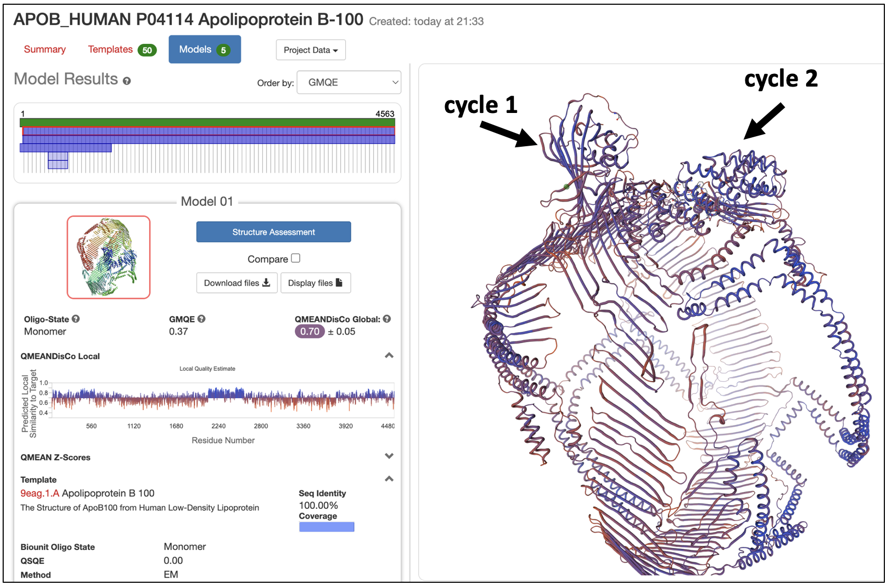
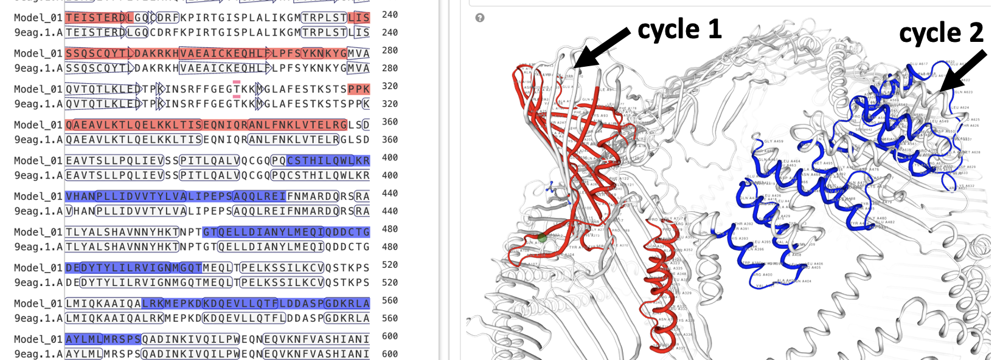
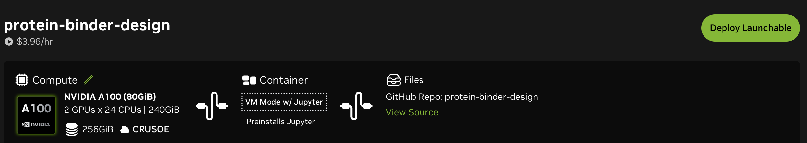
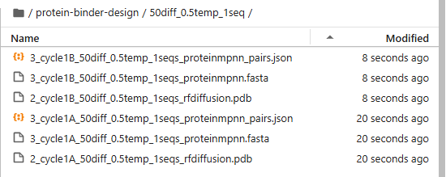
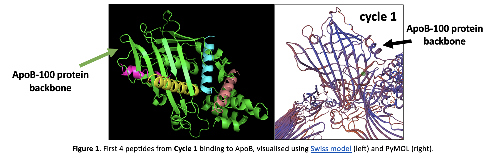
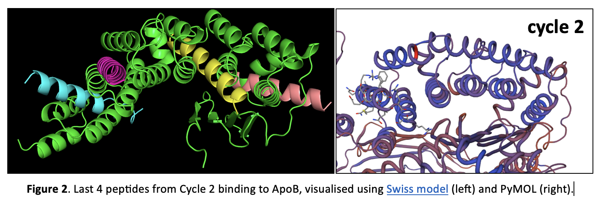

# NVIDIA BioNeMo: Protein Binder Design for Drug Discovery

This workflow is designed for _in silico_ protein binder design by generating binder sequences and predicted structures for the binder and target. Unlike the original NVIDIA pipeline, this approach **does not** require running Alphafold2 on cloud GPU. 

Instead, you will first pre-compute the target protein structure on [AlphaFold2 colab](https://colab.research.google.com/github/sokrypton/ColabFold/blob/main/AlphaFold2.ipynb#scrollTo=R_AH6JSXaeb2) (step #1), and save it as a `.PDB` file. This becomes the input for **RFDiffusion** (step #2), which generates the protein backbones for binder design. Subsequently, **ProteinMPNN** (step #3) will back-generate the amino acid sequence of this protein binder. Finally, this generated peptide structure is validated (step #4) on [PRODIGY](https://rascar.science.uu.nl/prodigy/) (Gibbs Free Energy) and Rosetta [FlexPepDoc](https://r2.graylab.jhu.edu/auth/login?next=%2Fapps%2Fsubmit%2Fflexpepdock). 

The example workflow illustrated below generates 8 peptide binders for target protein ApoB-100. We will also generate their multimer structures (in PDB format).

### System Requirements

- at least 1300 GB (1.3 TB) of fast NVMe SSD space
- modern CPU with at least 24 CPU cores
- at least 64 GB RAM
- 2 or more NVIDIA L40s, A100, or H100 GPUs

### Software Pre-requisites

- Python 3.11+

### Hardware requirements

- Total: 2 x GPU, 47 GiB GPU memory, 1.3TB GB SSD drive space, 60GiB RAM,24 CPU

    - **RFdiffusion** runs on 1 x GPU, ≥12 GiB GPU memory, 15GB free SSD drive space
    - **ProteinMPNN** runs on 1 x GPU, ≥3 GiB GPU memory, 10GB free SSD drive space


## 1. Manually select binding sites on target protein

 **Fig 1**. 3D model of ApoB-100 (target) on SWISS-MODEL

1. Get on the [SWISS-MODEL](https://swissmodel.expasy.org/) repository and in the search bar, type in your target protein of interest to view the interactive 3D model. In this example, we used [ApoB-100](https://swissmodel.expasy.org/repository/uniprot/P04114?template=9eag.1.A&range=38-4563) (**Fig 1**).
2. Define your 'binding window' size, which affects how long your generated peptide binder will be. In this example, we designed 8 binding windows of 40 amino acids in length.
3. Manually select these 8 binding sites on the 3D interactive model. In this example, we chose 4 peptides within the first half of the ApoB protein sequence (residues A91–357) and 4 peptides within the second half (residues A390–642). The full ApoB-100 protein backbone consists of 4,563 amino acids (**Fig 2**).

 **Fig 2**. Manually identify the 8 target binding sites


**Table 1**. 8 target sequences of length 40 amino acids.

| Cycle         | ApoB-100 target sequence          | Amino Acid Position |
|---------------|---------------------------------------------|---------------------|
| 1A      | LKTSQCTLKEVYGFNPEGKALLKKTKNSEEFAAAMSRYEL    | A91-130            |
| 1B      | EEAKQVLFLDTVYGNCSTHFTVKTRKGNVATEISTERDLG    | A170-209           |
| 1C      | VAEAICKEQHLFLPFSYKNKYGMVAQVTQTLKLEDTPKIN    | A255-294           |
| 1D      | PKQAEAVLKTLQELKKLTISEQNIQRANLFNKLVTELRGL    | A318-357           |
| 2A      | CSTHILQWLKRVHANPLLIDVVTYLVALIPEPSAQQLREI    | A390-429           |
| 2B      | GTQELLDIANYLMEQIQDDCTGDEDYTYLILRVIGNMGQT    | A459-498           |
| 2C      | LRKMEPKDKDQEVLLQTFLDDASPGDKRLAAYLMLMRSPS    | A531-570           |
| 2D      | EQVKNFVASHIANILNSEELDIQDLKKLVKEALKESQLPT    | A587-626           |

## 2. AlphaFold2 Colab (free)

For each of the 8 target sequences (**Table 1**), compute their 3D structure (.PDB) on [AlphaFold2 colab](https://colab.research.google.com/github/sokrypton/ColabFold/blob/main/AlphaFold2.ipynb#scrollTo=R_AH6JSXaeb2). On this colab notebook, perform the following steps for each sequence:

1. Input sequence under `query_sequence`
2. Hit `Runtime` > `Run all` and wait ~ 5mins
3. Download .zip results, decompress it and save the model with this suffix `...rank_001_alphafold2_ptm_model_1_seed_000.pdb` (this is because AlphaFold2 automatically generates 5 possible structures, with the first model being the one with the highest confidence, based on [pLDDT](https://www.ebi.ac.uk/training/online/courses/alphafold/inputs-and-outputs/evaluating-alphafolds-predicted-structures-using-confidence-scores/plddt-understanding-local-confidence/))
4. Rename this model file to `pep${Cycle}.pdb`.


## 3. Launch a NVIDIA cloud virtual machine (VM)

1. Go to [brev.nvidia](https://brev.nvidia.com/) and click on this [Launchable](https://brev.nvidia.com/launchable/deploy/now?launchableID=env-32aLABBLqme9fNaaSdVL94Bollg). If you would like to create your own, click on Launchables in the menu bar, then `Create Launchables` and follow these settings:
    - Select "I have codes in a git repository" and enter the URL of this repo
    - Select 'VM-mode'
    - Click "Next" until you finally reach **select compute**. We recommended **A100 (80GiB) 2 GPUs x 24 CPUs | 240GiB  (80GiB GPU memory) ($3.96/hr)**




2. Click **"Deploy Launchable"** and **"Go to Instance Page"**. Wait ~10 minutes for VM to start

3. Enter the VM, then drag and drop the AlphaFold2 .pdb files from **step (2)** into your workspace

4. Start a new terminal session by clicking the "+" button at the top right.

5. An **NGC Personal API Key** is required to download and run any NVIDIA NIMs. If this is your first time, start by creating an account on [NGC](https://catalog.ngc.nvidia.com/). Then [generate the key](https://org.ngc.nvidia.com/setup/api-key) and note it down somewhere secure for future use.

```bash
    export NGC_CLI_API_KEY=<enter-key> 
    # Example: 
    #   export NGC_CLI_API_KEY=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
    docker login nvcr.io --username='$oauthtoken' --password="${NGC_CLI_API_KEY}"
```

6. Build inference models via docker container. Wait 20-30mins for the docker to build.

```bash
    # Install Dependencies
    sudo apt-get update # updated nvidia toolkit
    sudo apt-get install -y docker-compose # docker compose version 2+
    sudo apt install python3.11

    # The NIM cache allows you to download models and store previously-downloaded models on your local/server disk,
    # so that you don’t need to download them again later when you run the NIM again. 
    mkdir -p ~/.cache/nim
    chmod -R 777 ~/.cache/nim    
    export HOST_NIM_CACHE=~/.cache/nim

    # From the root of the cloned protein-binder-design repository:
    cd deploy/
    docker compose up # runs /deploy/docker-compose.yaml
```

7. Open a new terminal, leaving the current terminal open with the launched service.

8. In the new terminal, view running containers with the following codes. Wait until the health check returns `{"status":"ready"}` before proceeding.

```bash
    # 1. Check storage space
    df -h 

    # 2. Check which dockers are currently active/on stand-by
    docker container ls
    docker ps 
    # Example:
        # CONTAINER ID   IMAGE                             COMMAND                   CREATED         STATUS         PORTS                                                             NAMES
        # 8ac6ad7cbb27   nvcr.io/nim/ipd/rfdiffusion:2.0   "/bin/sh -c 'exec \"$…"   2 minutes ago   Up 2 minutes   0.0.0.0:8082->8000/tcp, [::]:8082->8000/tcp                       protein-binder-design-rfdiffusion-1
        # 87cf41c4e7c6   nvcr.io/nim/ipd/proteinmpnn:1.0   "/bin/sh -c 'exec \"$…"   2 minutes ago   Up 2 minutes   6006/tcp, 8888/tcp, 0.0.0.0:8083->8000/tcp, [::]:8083->8000/tcp   protein-binder-design-proteinmpnn-1

    # 3. Health check 
    curl localhost:8082/v1/health/ready # RFdiffusion
    curl localhost:8083/v1/health/ready # Protein MPNN
    curl localhost:8084/v1/health/ready # AlphaFold multimer

    # Example:
        # {"status":"ready"}
```

## 4. Run RFDiffusion and ProteinMPNN

```bash
    # Define the cycle-to-target_sequence mapping
    # Example
    declare -A cycle_to_sequence=(
        ["1A"]="LKTSQCTLKEVYGFNPEGKALLKKTKNSEEFAAAMSRYEL"  
        ["1B"]="EEAKQVLFLDTVYGNCSTHFTVKTRKGNVATEISTERDLG" 
        # ["1C"]="VAEAICKEQHLFLPFSYKNKYGMVAQVTQTLKLEDTPKIN"
        # ["1D"]="PKQAEAVLKTLQELKKLTISEQNIQRANLFNKLVTELRGL" 
        # ["2A"]="CSTHILQWLKRVHANPLLIDVVTYLVALIPEPSAQQLREI" 
        # ["2B"]="GTQELLDIANYLMEQIQDDCTGDEDYTYLILRVIGNMGQT" 
        # ["2C"]="LRKMEPKDKDQEVLLQTFLDDASPGDKRLAAYLMLMRSPS"
        # ["2D"]="EQVKNFVASHIANILNSEELDIQDLKKLVKEALKESQLPT"
    )

    num_seq=1 # one peptide binder per target sequence
    diffusion=50 # recommended 20-50
    temp=0.5 # recommended range from 0.2 to 0.8
    contigs="15-20"

    # Export your API key one more time before running script (or else there will be an error)
    export NGC_CLI_API_KEY=<enter-key> # Example: export NGC_CLI_API_KEY=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

    # cycles=("1A" "1B" "1C" "1D" "2A" "2B" "2C" "2D")
    cycles=("1A" "1B")
    for cycle in "${cycles[@]}"; do
        target_sequence=${cycle_to_sequence[$cycle]}

        echo "Running script for $cycle..."
        dir="/home/ubuntu/protein-binder-design/scripts"
        python3.11 ${dir}/4_protein_binder_design.py  --cycle ${cycle} --num_seq ${num_seq} --diffusion ${diffusion} --temp ${temp} --target_sequence ${target_sequence} --contigs ${contigs}
    done
```

While results are being generated, ensure you download them into a new directory on your local computer:

```bash
    DIR_WORK="/set/your/local/directory"
    mkdir -p $DIR_WORK
    cd $DIR_WORK # contains RFDiffusion and ProteinPMNN results
```

 **Fig 3**. Example of the output directory containing results from this notebook example.

> [!NOTE]
> Now, you may exit and shutdown the NVIDIA VM so it doesn't keep charging money.

## 5. Visualization and validation of binder-target (locally)

### (a) PRODIGY Gibbs Free Energy

[PRODIGY web server](https://rascar.science.uu.nl/prodigy/) can calculate gibbs free energy.

1. We must provide the PDB of the binder-target complex as a multi-PDB file. To generate this file, you will need two inputs: 
(a) the PDB of the original protein structure and (b) PDB of the generated protein binder (i.e. peptide 1A). 

Run code below:

```bash
root="/directory/of/script/" # where the script is stored
new_chain="B" # edit chain A to become chain B
parameter="1seqs_50diff_05temp" # filename

for cycle in "1A" "1B" "1C" "1D"; do
    Rscript "${root}/conversion.R" $cycle $new_chain $parameter
done
```

An example of a resulting multi-PDB format with designed **peptide binder** (Chain B) binding to a defined region on **ApoB protein** (Chain A):

```bash
MODEL     1                                                                     
ATOM      1  N   LEU A   1       3.770  10.500 -13.625  1.00 64.62           N  
ATOM      2  CA  LEU A   1       3.465   9.531 -12.578  1.00 64.62           C  
ATOM      3  C   LEU A   1       4.594   8.516 -12.430  1.00 64.62           C  
ATOM      4  CB  LEU A   1       2.152   8.805 -12.883  1.00 64.62           C  
ATOM      5  O   LEU A   1    
ATOM      2  CA  GLY B   1      18.770  -4.344 -4.925  1.00 64.62        
ATOM      2  CA  PRO B   1      11.324  -4.344 -4.925  1.00 30.20        
```

### (b) FlexPepDoc

Please log in to GitHub to use the [FlexPepDoc ROSIE web server](https://r2.graylab.jhu.edu/auth/login?next=%2Fapps%2Fsubmit%2Fflexpepdock).


### (c) PyMol

Load the generated multi-PDB files into PyMOL (download latest version [HERE](https://www.pymol.org/)) for visualization of all peptide binders (more than one peptide) to the target protein.

Use the command to generate a multi-PDB file consisting of more than one peptide binder:

```bash
    cycle="2"
    diffusion=50
    temp=0.5 
    parameter="${diffusion}diff_${temp}temp"

    Rscript "./src/conversion_all.R" $cycle $parameter`
```

 **Fig 4**. First 4 peptides from Cycle 1 binding to ApoB, visualised using Swiss model (left) and PyMOL (right).


 **Fig 5**. Last 4 peptides from Cycle 2 binding to ApoB, visualised using Swiss model (left) and PyMOL (right).

## Notebook

A similar example of the workflow is available in jupyter notebook format [/scripts/protein-binder-design_Sept2025.ipynb](/scripts/protein-binder-design_Sept2025.ipynbscript/protein-binder-design_Sept2025.ipynb)

## Full NVIDIA pipeline

Downloading the [AlphaFold2]() and [AlphaFold2-Multimer](https://docs.nvidia.com/nim/bionemo/alphafold2-multimer/latest/quickstart-guide.html) model requires an additional 1250GB and 512GB of free SSD drive space respectively. Their download time (running the `docker compose pull` step) is also very long, up to 4-10 hours on 100+ Mbps internet connection for both models.

These models can:

- AlphaFold: Predict protein structure given a protein sequence
- AlphaFold2-Multimer: Predict protein structure given multiple protein sequences

